# FITCHA project

> To find your outfit size for better shopping experience
>
> [Link](https://dsportfolio2.pythonanywhere.com/) to the web app (It's under maintenance for the time being)

 

  This is a project is to mitigate size mistakes during online shopping, especially for ladies. It is a mini project, a part of class 'Intelligent Service Development with Big Data' delivered by Samsung Multicampus in Soeul, Korea - an affiliate of Samsung for education - and operated by Korean Ministry of Employment and Labor as a K-digital training scheme.

  This README file is only about data analysis behind FITCHA app. To see how the webpages were set up, please explore and enjoy the service yourself following the [link](https://dsportfolio2.pythonanywhere.com/) here.

 

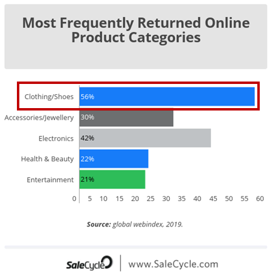

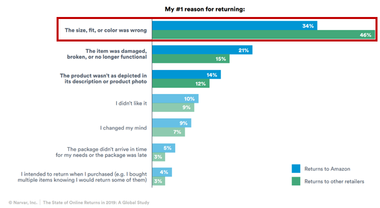

  From the charts above, it is shown that clothing is returned most in online shopping, and the main reason of returning is size and fit problem. Thus, I wanted to make a service to help with finding the right size so that it helps reduce the return rate for retailers and improves shopping experience for customers.

​    The aim of this project is to build an appropriate classification model to predict customers' size to deliver a bespoke service. Not only just suggest size, it will also direct customers to shopping pages so that the recommendation can be utilized for shopping.

  The data used was from Kaggle. You can find it [here](https://www.kaggle.com/tourist55/clothessizeprediction). 

  

## 1. Configuration of Web Application by Django

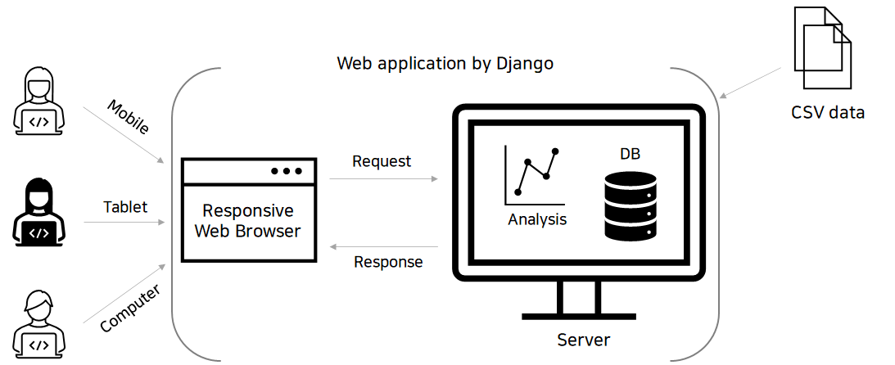

 

  The framework used to forge this web application is Django. In server-side, machine learning analysis and database process are done. On the other hand, in client-side, the webpage is built with the help of bootstrap for a responsive webpage.

  

## 2. Libraries and Programmes

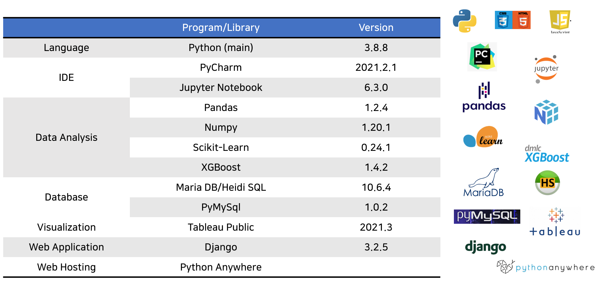

  Just an overall view of what libraries, programmes and programming languages were used for this project.

  

## 3. Explore the Data

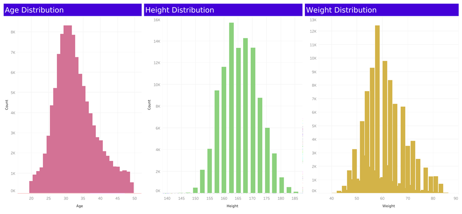

  The data are distributed in a bell shape. It's the case of the weight as well, but there's occasionally some low-frequency values in weight.  

 

<noscript></noscript><object class='tableauViz'  style='display:none;'><param name='host_url' value='https%3A%2F%2Fpublic.tableau.com%2F' /> <param name='embed_code_version' value='3' /> <param name='site_root' value='' /><param name='name' value='feature_relation&#47;2' /><param name='tabs' value='no' /><param name='toolbar' value='yes' /><param name='static_image' value='https:&#47;&#47;public.tableau.com&#47;static&#47;images&#47;fe&#47;feature_relation&#47;2&#47;1.png' /> <param name='animate_transition' value='yes' /><param name='display_static_image' value='yes' /><param name='display_spinner' value='yes' /><param name='display_overlay' value='yes' /><param name='display_count' value='yes' /><param name='language' value='en-US' /></object>
                

  It was to see what features would have much impact on the size prediction. The taller and the heavier, the bigger the size is. However, it is not obvious from the second chart that size is related to age. It needs to be investigated what is better to include age column or not for better prediction.

  

## 4. Preprocessing

#### 1) Simple preprocessing

  The data comprises columns of weight, age, height and size. Firstly, all the rows with NaN values were dropped (total 581), age dtype was changed from `float` to `int`, and height was rounded to one decimal point.

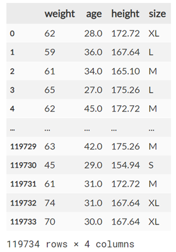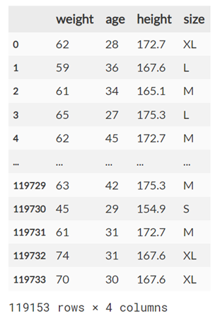

 

#### 2) Remove outliers

  The second step is to remove outliers as it contains lots of unusual values, eg. age 0 or too low weight.

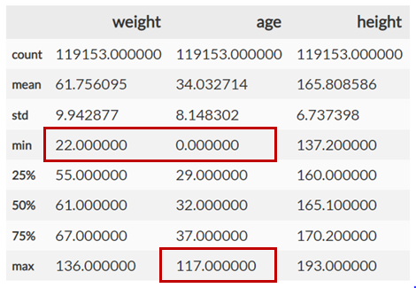

  Secondly, the age range was narrowed to 20 to 60, considering the prospective users' age. And then, the outliers were removed through two steps, in terms of the whole data distribution (chart above) and each size distribution.

<noscript></noscript><object class='tableauViz'  style='display:none;'><param name='host_url' value='https%3A%2F%2Fpublic.tableau.com%2F' /> <param name='embed_code_version' value='3' /> <param name='site_root' value='' /><param name='name' value='preprocessed_boxplot&#47;1' /><param name='tabs' value='no' /><param name='toolbar' value='yes' /><param name='static_image' value='https:&#47;&#47;public.tableau.com&#47;static&#47;images&#47;pr&#47;preprocessed_boxplot&#47;1&#47;1.png' /> <param name='animate_transition' value='yes' /><param name='display_static_image' value='yes' /><param name='display_spinner' value='yes' /><param name='display_overlay' value='yes' /><param name='display_count' value='yes' /><param name='language' value='en-US' /></object>
                

  Now we get more refined data to go further.

  

## 5. Limitation of the Data

  I admit the data is not that reliable as the source is not known. If you come to this page after using the service and finding the prediction was not that great, this part will address the point. 

  The reason I stuck to the Kaggle data is that it's hard to get customers' data due to the private information issue. Plus, once I get reliable data, this whole system can be used. For this reason,  I also include a section in the web application to gather the actual size of customers who wants to provide it.

 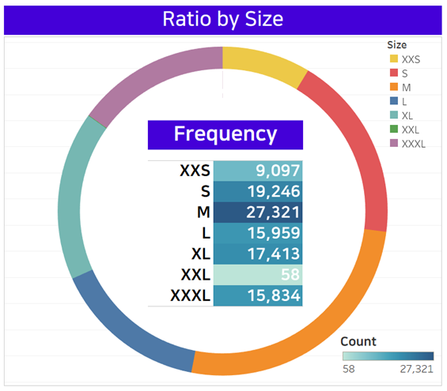

  As you can see from above, the ratio of each size is not even - XXL data takes too small share. Furthermore, there is no XS data which make it impossible to predict the size at all. I admit it will work badly for customers whose actual size is XS or XXL. 

 

  Another problem is that it is not mentioned whether the size is preferred one or exact one for each person. If it is preferred size, it disturbs prediction as all people pursue different fit. If you explore data, people with similar physique chose different sizes, so it could be a preferred size which brings the huge difference in outcome in case the service has to suggest an exact size.

 

Despite of these recognized issues, I further analysed data to build a whole frame of an web application.

  

## 6. Results of Classification Model

#### 1) Exclude Age

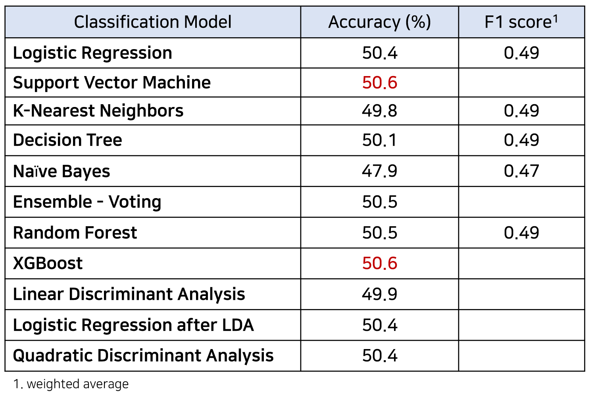

#### 2) Include Age as a Feature

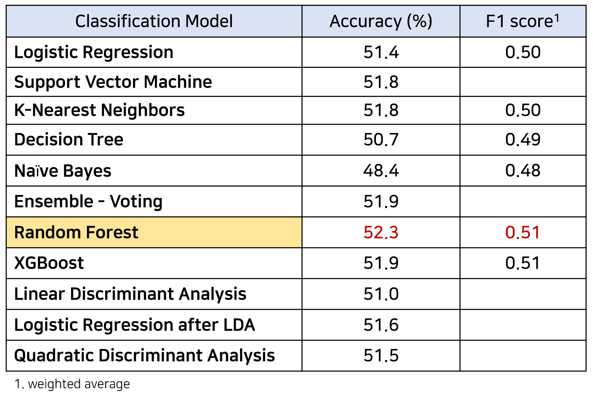

  The classification result is not that impressive as expected from the data. It is found that the better prediction is achieved when including age - the best model was Random Forest. So the service is designed to predicts size from age, height and weight information with Random Forest model.

 

  The chart below demonstrates the difference between prediction and actual data well. It was drawn from Linear Discriminant Analysis which reduced the dimension of features into 2.

<noscript></noscript><object class='tableauViz'  style='display:none;'><param name='host_url' value='https%3A%2F%2Fpublic.tableau.com%2F' /> <param name='embed_code_version' value='3' /> <param name='site_root' value='' /><param name='name' value='LDAVisual&#47;1' /><param name='tabs' value='no' /><param name='toolbar' value='yes' /><param name='static_image' value='https:&#47;&#47;public.tableau.com&#47;static&#47;images&#47;LD&#47;LDAVisual&#47;1&#47;1.png' /> <param name='animate_transition' value='yes' /><param name='display_static_image' value='yes' /><param name='display_spinner' value='yes' /><param name='display_overlay' value='yes' /><param name='display_count' value='yes' /><param name='language' value='en-US' /></object>
                

   

## 7. Database

  Databases were used 1) to build sign-in system and 2) to store shopping webpage links. Sign-in system encompasses features of sign-up, sign-in, sign-out, my info page, update info, delete account and success/error pages accordingly. The structure of tables is as below.

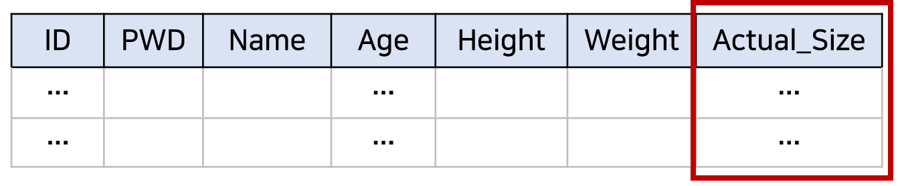

  The sign-in DB includes the column of Actual_size, which is intended to gather the data from customers who are willing to provide it, with a hope to improve data from this measure. If a customer provides the actual size, all the services will be provided based on it - like leading to shopping pages with the actual size, not the recommended one.  

  All the data on sign-up are stored in this table and will be retrieved for authentication. 

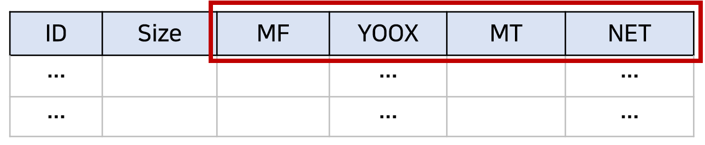

  The web links DB includes size recommended and webpage links to which the service page should be directed after size recommendation. MF, YOOX, MT, NET all indicate each specific website where we can search for an item by size.

  

## 8. Closing Remarks

  After all the trials and errors, the application was set up in the end. What I wanted to try this project was to use Tableau for visualization and connect Gmail with contact page. It's shame this data is pretty simple and doesn't have many options to try diverse visualization or make a decent dashboard.

 Hopefully, I wish to try this web app with better data. FITCHA app is well built up, so it will serve its purpose once it's given right data.

